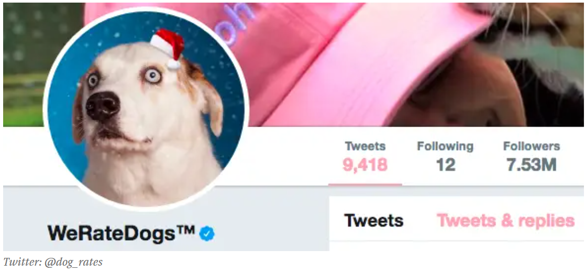

[LinkedIn]: https://www.linkedin.com/in/cyndimorris/
[][LinkedIn]  
# Trow  
I'm a Data Analyst. I really enjoy learning languages like Python and SQL to make analyzing data easier. I love to explore data to see what it has to say then create visualizations in Excel, PowerBI and Tableau to bring the stories to life.

## Skills and Experience  
Python / SQL / Excel / Power BI / Tableau  

## Examples of Work  
 | 

- 💬 Ask me about My pet air plant collection. 
- 📫 How to reach me: @gmail.com 
- ⚡ Fun fact: I LOVE gummy bears. 

    

